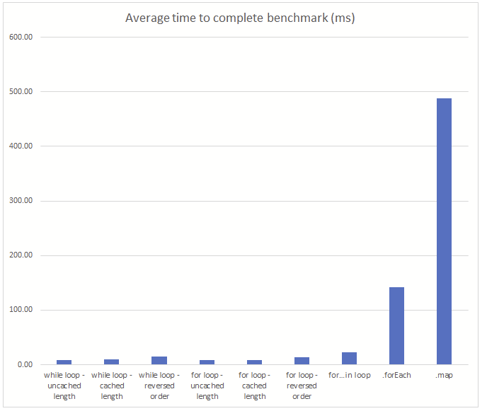

# Good to know for Improve Performance using Flutter

---

# 1. Use Widgets over Functions


### Bad

```
Widget buildFooterWidget() {
  return Padding(
    padding: const EdgeInsets.all(8.0),
    child: Text('This is the footer '),
  );
}

```

</br>


### Good

```
class FooterWidget extends StatelessWidget {
  @override

   Widget build(BuildContext context) {
    return Padding(
            padding: const EdgeInsets.all(8.0),
            child: Text('This is the footer '),
         );
    }
}
```

# 2. Use const where possible

```
class CustomWidget extends StatelessWidget {
  const CustomWidget();
  @override
  Widget build(BuildContext context) {
    ...
  }
}
```

- When building your widgets, or using flutter widgets. this helps flutter to rebuild only widgets that should be updated. The widget will not change when setState calls. It will prevent the widget to rebuild.

- You can save CPU cycles and use them with a const constructor.

# 3. Use nil instead const Container()

```
// good
text != null ? Text(text) : const Container()
// Better
text != null ? Text(text) : const SizedBox()
// BEST
text != null ? Text(text) : nil
or
if (text != null) Text(text)
```

> check [nil package](https://pub.dev/packages/nil)

# 4. Accelerate Flutter performance with Keys

```
// FROM
return value
   ? const SizedBox()
   : const Placeholder(),


// TO
return value
   ? const SizedBox(key: ValueKey('SizedBox'))
   : const Placeholder(key: ValueKey('Placeholder')),
```

```
// FROM
final inner = SizedBox();
return value ? SizedBox(child: inner) : inner,


// TO
final global = GlobalKey();
final inner = SizedBox(key: global);
return value ? SizedBox(child: inner) : inner,
```

- By using keys flutter recognizes widgets better. This gives better performance.

# 5. Optimize memory when using image ListView

```
ListView.builder(
  ...
   addAutomaticKeepAlives: false (true by default)
   addRepaintBoundaries: false (true by default)
);
```

- ListView couldn’t kill its the children are not being visible on the screen. It causes consumes a lot of memory if children have high-resolution images.

- Doing these options false, could lead to the use of more GPU and CPU work, but it could solve our memory issue and you will get a very performant view without noticeable issues.

# 6. Follow Dart style

### Identifiers: Identifiers come in three flavors in Dart

- UpperCamelCase names capitalize the first letter of each word, including the first.
- lowerCamelCase names capitalize the first letter of each word, except the first which is always lowercase, even if it’s an acronym.
- lowercase*with_underscores names use only lowercase letters, even for acronyms, and separate words with *.

### DO name types using UpperCamelCase.

Classes, enum types, typedefs, and type parameters should capitalize the first letter of each word (including the first word), and use no separators.

```
class SliderMenu { ... }
class HttpRequest { ... }
typedef Predicate<T> = bool Function(T value);
const foo = Foo();
@foo
class C { ... }
```

### DO name libraries, packages, directories, and source files using


### Bad

```
library pegparser.SourceScanner;
import 'file-system.dart';
import 'SliderMenu.dart';

```

</br>


### Good

```
library peg_parser.source_scanner;
import 'file_system.dart';
import 'slider_menu.dart';
```

> for more informations check [dart styles](https://dart.dev/guides/language/effective-dart/style)

# 7. Use MediaQuery/LayoutBuilder only when needed

# 8. Make use of async/await instead of then function.

# 9. Efficiently use operators

```
var car = van == null ? bus : audi;         // Old pattern
var car = audi ?? bus;                      // New pattern

var car = van == null ? null : audi.bus;    // Old pattern
var car = audi?.bus;                        // New pattern

(item as Car).name = 'Mustang';         // Old pattern
if (item is Car) item.name = 'Mustang'; // New pattern
```

# 10. Make use of interpolation techniques


### Bad

```
var discountText = 'Hello, ' + name + '! You have won a brand new ' + brand.name + 'voucher! Please enter your email to redeem. The offer expires within ' + timeRemaining.toString() ' minutes.';

```

</br>


### Good

```
var discountText = 'Hello, $name! You have won a brand new ${brand.name} voucher! Please enter your email to redeem. The offer expires within ${timeRemaining.toString()} minutes.';
```

# 11. Use for/while instead of foreach/map

> Caching the length of the list involves setting the length of the list we will be looping through to a variable before looping.

> We use [benchmark_harness](https://pub.dev/packages/benchmark_harness) for all test

### While loops

```
1. With uncached length (took around 9.14ms to complete)

var count = 0;
num eachElement = 0;
while (count < list.length) {
  eachElement = pow(list[count], 3);
  count++;
}


2. With cached length (took around 9.65ms to complete)

var count = 0;
num eachElement = 0;
var length = list.length;
while (count < length) {
  eachElement = pow(list[count], 3);
  count++;
}
```

### For loops

```
1. With uncached length (took around 9.08ms to complete)

for (var i = 0; i < list.length; i++) {
  eachElement = pow(list[i], 3);
}


2. With cached length (took around 9.01ms to complete)

num eachElement = 0;
var length = list.length;
for (var i = 0; i < length; i++) {
  eachElement = pow(list[i], 3);
}
```

### For…in loop (took around 22.70ms to complete)

```
num eachElement = 0;
for (var element in list) {
  eachElement = pow(element, 3);
}
```

### .forEach method (took around 140.27ms to complete)

```
num eachElement = 0;
list.forEach((element) {
  eachElement = pow(element, 3);
});
```

### .map method (took around 487.77ms to complete)

```
num eachElement = 0;
list.map((e) {
  eachElement = pow(e, 3);
}).toList();
```

### Loop result comparison bar chart



# 12. Precache your images and icons

```
precacheImage(AssetImage(imagePath), context);

**For SVGs you need flutter_svg package.

precachePicture(
  ExactAssetPicture(
    SvgPicture.svgStringDecoderBuilder,iconPath),context,
);
```

# 13. Use builder named constructors if possible

```
For example:
Listview → Listview.builder
```

# 14. Proper disposal of data

# 15. Set cacheHeight and cacheWidth values to images

### You can reduce memory usage in this way
